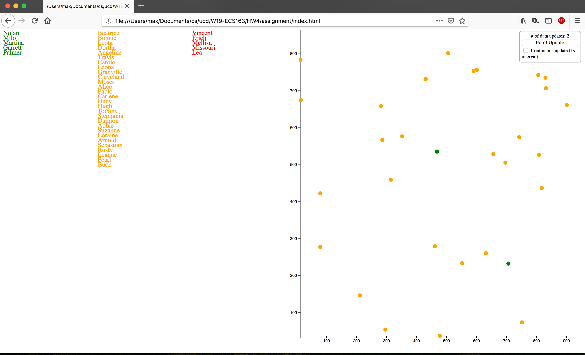

# Homework #4: Managing & Binding Data in D3

The goal of this homework is to get more experience implementing visualizations from scratch, and to internalize the d3 enter-update-exit pattern. You'll be creating two visualizations: A flow diagram (which graphically illustrates the enter-update-exit pattern), and a scatter plot (to dynamically display data). See video **homework_04.mov** in **Canvas > Files tab > Homework Files** folder.

> 🔍**Hint**: Don't forget that you may reference previous assignments, D3 reference books, and online examples (here's a [good one](https://bl.ocks.org/mbostock/3808234?fbclid=IwAR0XhOgQBfs93XoX_ixUh_Itjsmq-j__n6KjiU5ndbh-qOiGcRkxaoXQ2tI) that lists additional resources, and [this tutorial](https://www.dashingd3js.com/lessons/d3-basic-general-update-pattern) looks quite nice) to get yourself started. You'll almost certainly reference the official d3 documentation as well.

## Data Description

The data that you'll be using for this assignment will be randomly generated and updated (there's a `names.csv` file in the data directory, but you won't be using the data from that).

Data updates are managed through a built-in "control panel" in the top right of the webpage. 
* Clicking the "Run 1 Update" button will update the data in one iteration.
* checking the "Continuous Update" checkbox will run data updates at intervals of 1 second.

Data updates will call the `tickDataFlow` function with new data. Data updates include adding new data (**entering** data), changing existing data (**updating** data), and removing data (**exiting** data). You don't need to load in any data (e.g. `names.csv`); this is all handled for you already. 

Each data row has the following attributes:
* `name`: A name (not necessarily unique) for the element. Will not change. You'll use this in the flow diagram. 
* `id`: A unique identifier (guaranteed to be unique). Will not change. [This is what you should be using in your key function](https://github.com/d3/d3-selection/blob/master/README.md#selection_data).
* `v0`: A random value. May be changed in the update process. You'll use this in your scatter plot (but not the flow diagram). 
* `v1`: A random value. May be changed in the update process. You'll use this in your scatter plot (but not the flow diagram).

This behavior is handled in the `seedrandom.js` and `dataFlow.js files`, which you should not be editing.

## Provided Code

* `index.html`: You should not need to change this file for the assignment. It contains:
  * Two SVGs for your visualizations, classed `.flow` and `.scatter` for your flow diagram and scatter plot respectively.
  * A control panel for managing updates.
* `index.js`: Change this however you need, but don't re-name, move, or change the parameters of `initCharts` or `tickDataFlow`.
  * You can consider this the "control center" for your visualizations. `initCharts` will be called once to instantiate your charts, and `tickDataFlow` will be called with each data update.
* `scatterPlot.js` and `flowDiagram.js`: Change however you need.
  * These files have constructors for your scatter plot and flow diagram respectively, with some small starter code to give you the dimensions of your SVG elements (since they're dynamically sized) and to define your margins. This is where you "set up" your chart objects so you can store some state and functions; treat it like any other constructor. 
  * Note that to bind functions (e.g. `draw`) to the object so they can be used later externally, you'll need to use `this`; e.g. `this.draw = function(...) {...}`.
* `d3.js`, `seedrandom.js`, and `dataFlow.js`: Should not be edited.

> 🔍**Hint**: You can view this as having a few sections of stub code: in `index.js`, you have `initCharts` (which you shouldn't really touch unless you're adding another chart or interactions between the charts), and `tickDataFlow` (where you'll receive new data every time you interact with the control panel in the top right of the page; you should be updating your visualizations from here). You also have your chart object stubs in `scatterPlot.js` and `flowDiagram.js`. 

> 🔍**Hint**: To attach a function to an object so you can reference it later (e.g. in scatterPlot.js and flowDiagram.js, you can use `this`, e.g. `this.draw = function(newData) { ... }`.

> 🔍**Hint**: Once you define your draw function, you'll need to actually draw the chart for the first time by calling that function in your constructor. 

## Visualizations

Here's what your assignment should be similar to when you're done. See the demo video on Canvas for the assignment in action.

On the left is the data flow visualization, and on the right is the scatter plot.

**Note:** Your visualizations don't have to *exactly* match up with what you see in the video and screenshot. Focus on conveying the data flow... aspects like circle radius, tick formatting, font aren't important for this assignment.

### Data Flow Visualization

Your data flow vis should illustrate how data moves between the entering, updating, and exiting data. You'll be binding your data to text elements, using each datum's name for the text.

* Data that's entering should appear in the left column, and be colored   `green`.
* Data that's updating should transition (animate) to the middle column, and be colored   `orange`.
* Data that's exiting should transition to the right column, and be colored  `red`.

Like the video shows, you should keep the ordering of each column "nice"; that is to say, you shouldn't have spaces or gaps between each text element and they shouldn't overlap. Maintain text legibility. (The video shows this behavior.)

* Notice in the update column, elements shift upwards if necessary (e.g., the element does not transition to the exit column and there are gaps above that need to be filled). You might need to do some processing and create a few variables to keep track of vertical text positions. Keep in mind that elements can have the same `name` value.

* Elements in the exit column (from the previous iteration) should be removed as new data is moved into it.

> 🔍**Hint**: To get started, think about how you want to break this problem up into component pieces (in this case, there's really only two): positioning each category (enter/update/exit), and positioning, coloring each element within a category.

> 🔍**Hint**: You'll probably want to use the [SVG](https://developer.mozilla.org/en-US/docs/Web/SVG/Element/text) text element for this. The [selection.text function](https://github.com/d3/d3-selection/blob/master/README.md#selection_text) will let you set the actual displayed text. 

> 🔍**Hint**: Hint: You can access the data of each selection using `selection.data()`. For example, you would use `selection.enter().data()`, `selection.data()`, and `selection.exit().data()` to get the data arrays being routed to your enter, update, and exit selections respectively. By default, the update selection is selected (i.e., you don't do `selection.update()`, you just continue with `selection`).

> 🔍**Hint**: You can use a band scale (`d3.scaleBand`) to segment your data by 'category' (enter, update, exit) spatially. E.g., having a band scale with a domain of `['enter', 'update', 'exit']` and a range of `[0, svgWidth]`, and using that domain to categorize your data in the update function.

> 🔍**Hint**: You should let d3 handle the enter-update-exit logic for you; i.e., you can bind just one set of data and manipulate those selections conditionally, instead of binding one selection per column (unless you want to keep track of that manually or do [nested data binding](https://bost.ocks.org/mike/nest/), which might be a bit more work).

## Scatter Plot Visualization

Your scatter plot visualization should plot the data as it's being updated, using`v0` for the x-axis and `v1` for the y-axis.

* Your data scale domains should change to reflect the data.
* Data that's entering should be colored green.
* Data that's being updated should be colored orange.
* Data that's exiting should be removed from the visualization.
* You should animate the transition between entering and updating elements, and updating elements that are changing position. This behavior may be seen in the demo video.
* The x- and y-axes should optionally smoothly transition as they scale. (The video does NOT show this, but it's allowed.)
* You also have the option to add (for minor extra credit) a regression line for the data in the view. The video does NOT show this. The regression line should update as transitions occur.

> 🔍**Hint**: Start by defining your scales from the data extent and getting the axes drawn. From there, you can use your scales to position the data you'll be binding. You can update your scale domains by calculating the extent of your new data at update time.
> 🔍**Hint**: You can use d3-transition for implementing the animation between entering and updating elements.

## Grading Critiera

Your finished product should look something like the reference video. As stated above, exact styling isn't required, but the enter/update/exit behavior should reflect the video. This assignment is worth 10 points:

* The data flow visualization is worth 5 points.
* The scatter plot aspect is worth 5 points.
